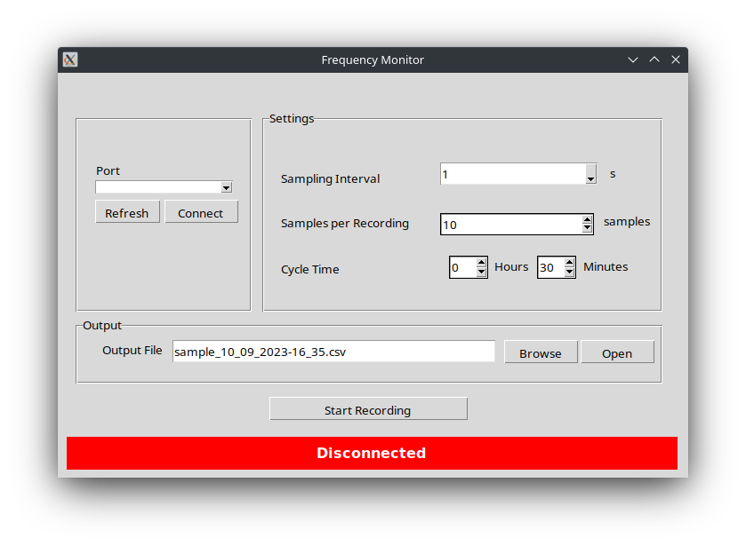
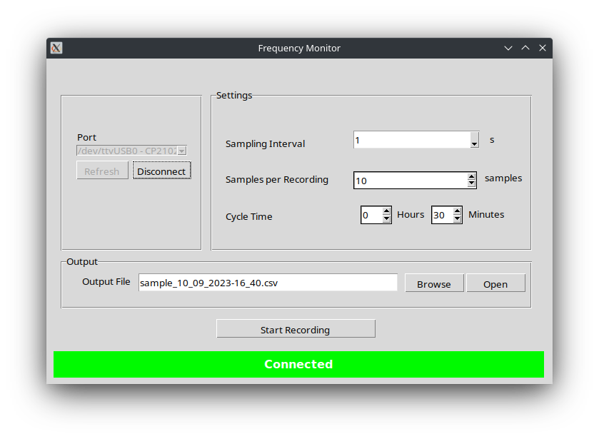
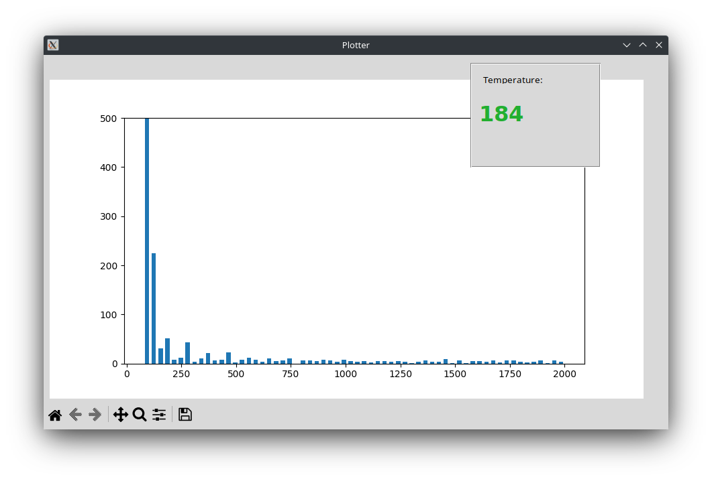

# Frequency Logger Python GUI

### Brief
This is a simple sound frequency logger which records sounds from the surroundings and logs the data to storage for interpretation and inference. The project is built on the Arduino Uno which runs on an ATMega328P microcontroller, it includes a microphone module with an amplifier, and a temperature sensor as the primary data sensors. The primary purpose of this project was trying to establish patterns in mosquito behaviour and presence depending on temperature changes, and perhaps figuring out a mitigation strategy by the use of this data.

### Python GUI

### Real-Time Frequency Plot

